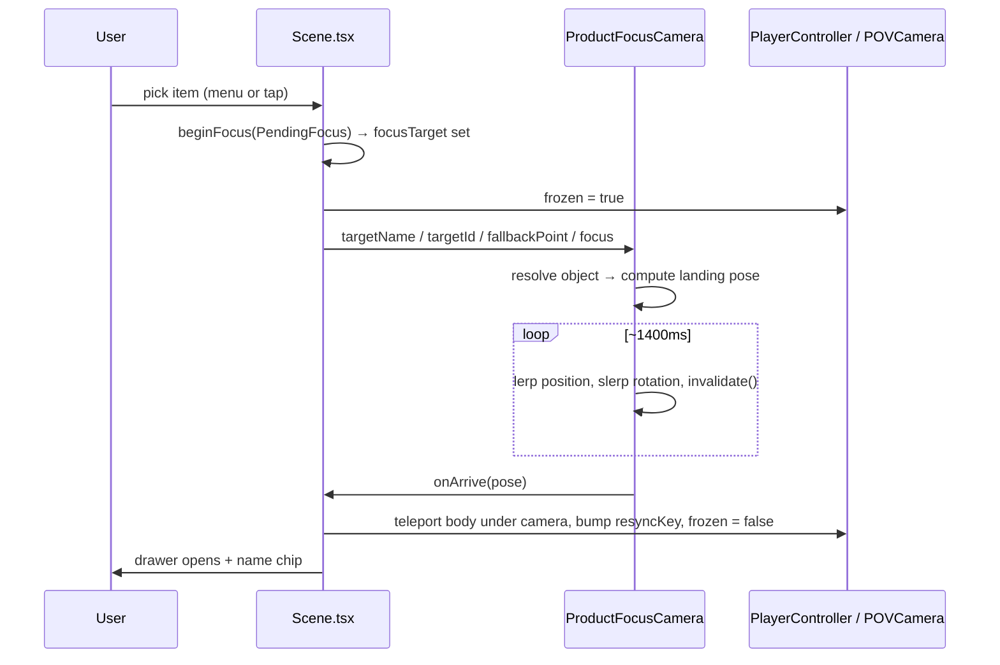

# Store — Product Focus & Catalogue

How `/store` moves the camera to a product, and how to configure the data behind it.

Covers: the category browser, the camera flight, and the two JSON files that drive them.

---

## 1. What happens when you pick a product

Two entry points, one code path:

- **Category menu** (`CategoryBar`) — مبلمان → مبل ال → مبل ال مخملی
- **Direct tap** on the mesh in the 3D scene (`ProductInteraction` raycast)

Both call `beginFocus()` in `Scene.tsx` with a `PendingFocus`, which sets `focusTarget` and starts the flight. When it lands, the drawer opens and the product name appears in the top bar.



### Why the freeze exists

This is the part to understand before touching any of it. In `/store` the camera is **not free**:

- `usePlayerPhysics` (`PlayerController.tsx`) writes `camera.position` from the Rapier body **every frame**
- `usePOVCamera` (`POVCamera.tsx`) writes `camera.quaternion` **every frame**

So a tween that just sets the camera is overwritten on the next frame, and even if it weren't, the camera would snap back to the body the instant the tween ended. The flight therefore:

1. **Freezes both writers** — `usePlayerController(..., frozen)` and `usePOVCamera({ frozen })`. The body's velocity is also zeroed so it can't drift while the view is elsewhere.
2. **Animates freely** — `lerpVectors` for position, `slerpQuaternions` for rotation. Slerp, not a lerped look-at point: lerping the target whips the view through a curve and introduces roll.
3. **Hands control back on landing** — teleport the rigid body to `pose.position.y - cameraHeight`, bump `resyncKey` so `usePOVCamera` adopts the landed yaw/pitch, then unfreeze. **Order matters.** Without the resync, the first drag after landing snaps back to the pre-flight heading.

The scene runs `frameloop="demand"`, so the flight calls `invalidate()` **every frame**. An animation that doesn't request frames renders exactly one and then freezes.

---

## 2. The two JSON files

They are deliberately separate.

| file | what it is | keyed by |
|---|---|---|
| `public/config/products.json` | **the room** — what physically exists, one entry per mesh | scene-object name (`modern-sofa`) |
| `public/config/catalog.json` | **the shop** — categories and the browsable item list | its own `items[].id` |

`products.json` is load-bearing for two existing systems: `ProductInteraction` matches the raycast hit against each entry's `id`, and `FurnitureColorApplier` finds paint targets by name. Don't restructure it.

A catalogue item points into it with **`sceneObject`**, which is why several catalogue entries can share one physical mesh — the showroom has three real pieces but the menu lists fifteen products.

### Which file wins

`resolveCatalogItem()` (`lib/store/catalog.ts`) merges them:

- **From the catalogue:** `name`, `price`, `category`, `type`
- **From the room:** `colors`, `fabricType`, `fabricMaterials`, `detailedDescription`, `dimensions`, `material`, `weight`, `glbPath`, `usdzPath`

So a product's own `name` in products.json **never appears in the menu** — the catalogue name overrides it. It only shows when you tap the mesh directly, which bypasses the catalogue.

Likewise `"category": "مبل"` / `"type": "راحتی"` in products.json are free text. They are **not** matched against catalogue category ids and get overwritten by `mainCategory` / `subCategory`.

---

## 3. Adding to the catalogue

### A product

```json
{
  "id": "l-velvet",
  "name": "مبل ال مخملی",
  "price": 62000000,
  "mainCategory": "sofa",
  "subCategory": "l-shape",
  "sceneObject": "modern-sofa"
}
```

- `id` — unique across the catalogue. Used for likes and as the drawer's React key.
- `price` — plain integer toman. Rendered by `faPrice()` as Persian digits + تومان.
- `mainCategory` / `subCategory` — must match ids in `categories[]`. An unknown pair just means the item never shows.
- `sceneObject` — **must be a key in products.json**, or the item is unclickable and logs `[Scene] Catalogue item … points at sceneObject …`.

### A category or subcategory

```json
{
  "id": "storage",
  "label": "کمد و بوفه",
  "subCategories": [
    { "id": "buffet",    "label": "بوفه" },
    { "id": "wardrobe",  "label": "کمد دیواری" }
  ]
}
```

`label` is what the user sees; `id` is what items reference. The bar scrolls horizontally, but four main categories is what the layout is tuned for.

### A new physical product

Adding a genuinely new piece means the room GLB has a mesh for it. Then in products.json add an entry keyed by that mesh's name, with at minimum `id`, `name`, `colors`, and `billboardPosition`. Then point catalogue items at it.

---

## 4. Where the camera decides to stand

`frontBearing()` in `ProductFocusCamera.tsx`. Nothing in the data says which way a sofa faces, so it is derived:

1. **Candidates** — the object's four horizontal axes (`±X`, `±Z`) taken through its world rotation. Using the object's own basis is what makes the landing square-on, and it follows the piece automatically when the artist rotates it in the GLB.
2. **Pick** the one pointing most toward the **room centre** (`Box3.setFromObject(scene)`, computed once and cached). Showroom furniture sits against walls facing inward, so "inward" is both the front *and* the side that isn't inside a wall.
3. **Degenerate** — a product within `0.5` of the room centre has no meaningful inward direction, so it keeps its own local `+Z`.

Standoff distance and height come from the object's bounds:

```
distance = clamp(max(sizeX, sizeZ) * 1.1 + 1.2, 1.8, 6)
height   = max(sizeY * 0.25, 0.35)
```

The landing pose depends **only on the product**, never on where the player is standing. That is deliberate: an earlier version placed the camera between the product and the player, which meant a player already a standoff-distance away got pure rotation and no travel, and a player standing behind the sofa got a view of its back.

---

## 5. Tuning a product's framing

Add a `focus` block to any catalogue item. It overrides the automatic pose:

```json
{
  "id": "seg-classic",
  "name": "مبل سگمنتال کلاسیک",
  "sceneObject": "modern-sofa",
  "focus": { "azimuthDeg": 180 }
}
```

| field | meaning | default |
|---|---|---|
| `azimuthDeg` | where the **camera stands**, in degrees. `0` = +Z side, `90` = +X, `180` = −Z, `270` = −X | auto (`frontBearing`) |
| `distance` | standoff from the product centre, world units | from bounds, see above |
| `height` | camera height above the product centre | from bounds, see above |

### Workflow when a product is framed from its back

Every flight logs its bearing:

```
[ProductFocusCamera] "modern-sofa" bearing 143.2°
```

Add 180, put it in that item's `focus.azimuthDeg`, reload. The log then reads `… bearing 323.2° (authored)`. Remove the block to return to automatic.

The override is per **catalogue item**, not per mesh — two items sharing `modern-sofa` can be framed from different sides.

---

## 6. How the mesh gets found

The room is authored externally and its names don't reliably match either identifier we hold: products.json is *keyed* `modern-sofa` while its `id` is `modern-sofa-01`. `findSceneObject()` (`lib/store/sceneObject.ts`) therefore takes both names in priority order and scores every object in the scene by tier:

| tier | match | example |
|---|---|---|
| 0 | exact | `modern-sofa` = `modern-sofa` |
| 1 | scene name starts with candidate | `modern-sofa` → `modern-sofa-01` |
| 2 | candidate starts with scene name | `modern-sofa-01` → `modern-sofa` |
| 3 | either contains the other | — |

Best tier wins regardless of traversal order; ties go to the earlier candidate. `FurnitureColorApplier` uses the same resolver, so colours and camera always agree on which object a product is.

### If it still can't find one

The flight degrades rather than dead-ending:

1. mesh resolved → pose from its bounds
2. no mesh, but products.json has `billboardPosition` → fly to that point (standoff `2.6`, height `0.35`)
3. neither → no flight, but the drawer still opens

Cases 2 and 3 log a `[ProductFocusCamera]` warning listing the names actually present in the scene.

---

## 7. Invariants worth not breaking

- **`invalidate()` every animated frame.** `frameloop="demand"` means no invalidate = one frame then a freeze.
- **`ActivityGovernor`'s `forceActive` must include the flight** (`!!focusTarget`), or the demand loop parks mid-flight.
- **Resync before unfreezing.** Teleport the body, bump `resyncKey`, then release — any other order snaps the view.
- **No allocation inside `useFrame`.** Scratch vectors/quaternions live at module scope, matching `Joystick.tsx` and `POVCamera.tsx`.
- **`Object3D.lookAt` is not camera semantics.** For a non-camera object three swaps eye/target, so its **+Z** faces the target. The aim scratch is a `THREE.Camera` for exactly this reason — a plain `Object3D` lands the camera facing away from the product.
- **`bg-*` utilities don't work on `.glass` elements.** `glass` sets the `background` shorthand, which resets `background-color`. Tints need their own layer (see the active pill in `CategoryBar.tsx`).
- **The room is one fixed `colliders="trimesh"` body** (`ModelLoader.tsx`), and a trimesh has no inside. A capsule teleported within its shell is pinned by contacts every step — look-drag still works, walking silently doesn't. Any landing point must therefore be reachable: the flight casts from the player toward it and clamps short of the first hit. Cast **from the player**, never from the product — the player's position is known-free space, so the ray can't hit the product's own surface from within it.
- **The landing camera Y must be the player's eye height.** `usePlayerPhysics` forces the camera to `bodyY + cameraHeight` the instant control returns, so any other Y is both a jump at hand-off and — through the inverse teleport in `handleArrive` — a way to bury the capsule. Frame a low product by tilting down at its centre, not by lowering the camera.
- **Both entry points must hand the resolver the same names.** `ProductInteraction` passes the products.json *key*; the id follows as the secondary candidate. Passing the id first made a tap resolve a different object than the menu did for the same product.
- **Moving the joystick zone requires `manager.reposition()`.** nipplejs caches the stick's centre as a *page coordinate* at creation and measures every touch against it. It only refreshes on its zone `ResizeObserver` (**size** changes) or a window resize, so shifting the zone with `bottom` — which is how `liftPx` clears the drawer — slips past it, and a stale centre reports full deflection from a finger that never moved. `dynamicPage: true` also fixes it but re-measures on every move event; `reposition()` is the cheap one. Call it after the slide finishes, not just when the value changes.

---

## 8. Files

| file | role |
|---|---|
| `components/store/ProductFocusCamera.tsx` | the flight: resolution, pose, tween |
| `components/store/Scene.tsx` | `PendingFocus`, `beginFocus`, `revealProduct`, the freeze wiring |
| `components/store/PlayerController.tsx` | `frozen` — stops the body-follow camera write |
| `components/store/POVCamera.tsx` | `frozen` + `resyncKey` — stops and re-seats the look easing |
| `components/store/CategoryBar.tsx` | category → subcategory → product drill-down |
| `components/store/StoreTopBar.tsx` | menu / like / cart / product-name chip |
| `lib/store/catalog.ts` | catalogue types, `resolveCatalogItem`, `faPrice` |
| `lib/store/sceneObject.ts` | `findSceneObject`, `describeSceneNames` |
| `public/config/catalog.json` | categories + items |
| `public/config/products.json` | the room's products |

---

## 9. Console reference

| line | meaning |
|---|---|
| `[ProductFocusCamera] "…" bearing 143.2°` | normal — the bearing used for this flight |
| `… bearing … (authored)` | `focus.azimuthDeg` is in effect for this item |
| `[ProductFocusCamera] No object matched … falling back to billboardPosition` | mesh unresolved; flying to the authored point |
| `[ProductFocusCamera] No object matched … and no billboardPosition` | no flight; drawer opens where you stand |
| `[Scene] Catalogue item "…" points at sceneObject "…"` | `sceneObject` isn't a key in products.json |
| `[FurnitureColorApplier] Found object: "…"` | colour targets resolved |
| `[FurnitureColorApplier] Furniture object "…" not found` | colours won't apply — same naming problem |
